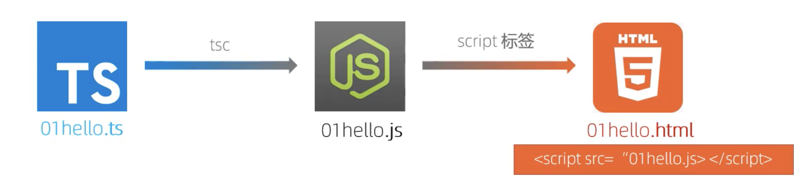
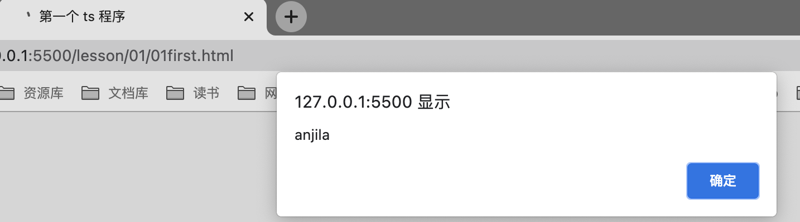
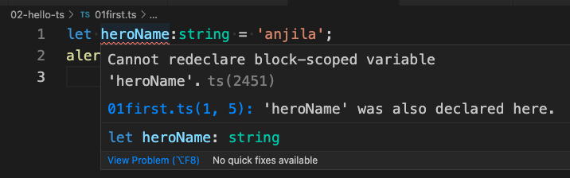

# 第一个程序


## 01. 创建一个 ts 文件

```ts
// 01first.ts
var heroName = 'anjila';
alert(heroName);
```

## 02. 使用 `tsc` 进行编译

使用 `tsc` 命令编译之后， 将会得到一个同名 js 文件。

```bash
# tsc ./01first.ts

# ls
01first.ts
01first.js
```

## 03. 创建 html 文件使用

使用命令 `touch 01first.html` 创建网页文件， 并在 **`head`** 中使用 `<script src="./01first.js"></script>` 语句导入编译后的 js 文件。


```html
<!DOCTYPE html>
<html lang="en">
<head>
    <meta charset="UTF-8">
    <meta http-equiv="X-UA-Compatible" content="IE=edge">
    <meta name="viewport" content="width=device-width, initial-scale=1.0">
    <title>第一个 ts 程序</title>
    <script src="./01first.js"></script>
</head>
<body>

</body>
</html>
```

打开浏览器， 运行结果如下



## 04. conflict name

在没有进行任何配置的情况下， 编译后的 **js文件** 与 **ts文件** 在同一个目录下面，因此 vscode 会提供有命名冲突。



这里先暂时忽略， 之后在工程化的时候， 将会配置 `tsconfig.json`， 将结果编译到其他目录 **(ex. `./dist`)**， 这个问题自然解决。
